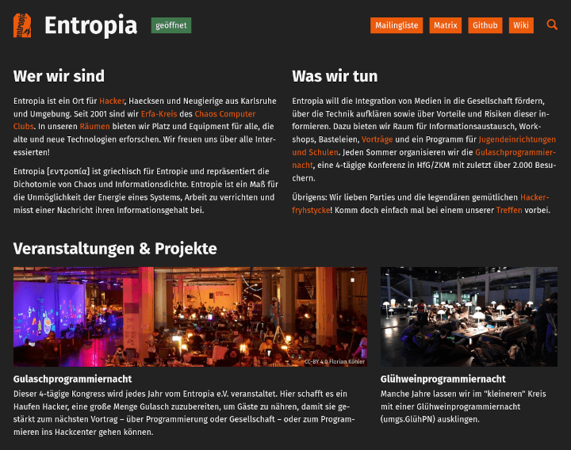

# Entropia landing page

The live site is available here: https://entropia.de



## Setup

### With Docker

1. Build the container

```bash
docker build -t entropia-landing-page:latest .
```

2. Run the container

```bash
docker run -p 3000:80 entropia-landing-page                             # production
docker run -p 3000:80 -v ./public:/var/www/html entropia-landing-page   # development
```

### Without Docker

#### Requirements

* A web server like nginx or Apache
* PHP >= 8.0 (the version on the entropia.de web server)

#### Steps

1. Clone this repository to any web server fulfilling the requirements listed above
2. Set the `public` folder as your web root directory
